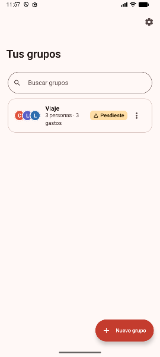
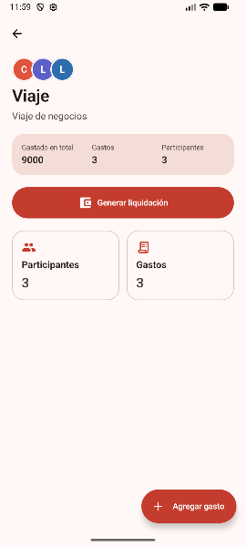
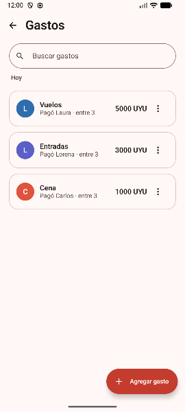
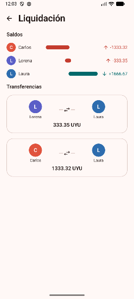

# SplitIt

SplitIt is a Kotlin Multiplatform mobile app for managing shared expenses among groups of people — trips, dinners, roommates, or any situation where money needs to be split fairly.

Built with **Compose Multiplatform**, it shares UI, domain logic, persistence, and navigation across **Android** and **iOS** while keeping each platform's entry point minimal.

---

## 📖 Documentation

- **[`docs/ARCHITECTURE.md`](./docs/ARCHITECTURE.md)** — complete architecture overview: layers, package responsibilities, patterns, design decisions, and testing strategy.
- **[`docs/DESIGN.md`](./docs/DESIGN.md)** — visual design system and per-screen specifications ("Cuentas claras" concept).
- **[`AGENTS.md`](./AGENTS.md)** — project conventions, build commands, and agent-specific notes.

---

## 📸 Screenshots

> _App screenshots will be added here._

| Groups                            | Group Detail                      | Expenses                              | Settlement                                |
|-----------------------------------|-----------------------------------|---------------------------------------|-------------------------------------------|
|  |  |  |  |

---

## 🏗️ Project Structure

* [`/composeApp`](./composeApp/src) is for code shared across Compose Multiplatform applications.
  * [`commonMain`](./composeApp/src/commonMain/kotlin) is for code common to all targets.
  * [`androidMain`](./composeApp/src/androidMain/kotlin) and [`iosMain`](./composeApp/src/iosMain/kotlin) hold platform-specific integrations such as the SQLDelight driver.
* [`/androidApp`](./androidApp/src/main/kotlin) contains the Android application entry point (`MainActivity`).
* [`/iosApp`](./iosApp/iosApp) contains the iOS SwiftUI host and the bridge to the Kotlin/Native `MainViewController`.

---

## 🚀 Build and Run

### Android Application

Build and run the development version from your IDE or directly from the terminal:

```shell
./gradlew :composeApp:assembleDebug
```

### iOS Application

Open the [`/iosApp`](./iosApp) directory in Xcode and run it from there, or use the run configuration in your IDE.

---

## 🧪 Running Tests

```shell
# Run JVM-backed unit tests
./gradlew :composeApp:testAndroidHostTest

# Run a specific test class
./gradlew :composeApp:testAndroidHostTest --tests 'com.splitit.domain.service.BalanceCalculatorTest'

# Run lint
./gradlew :androidApp:lint :composeApp:lint

# Full verification
./gradlew :androidApp:check :composeApp:check
```

---

Learn more about [Kotlin Multiplatform](https://www.jetbrains.com/help/kotlin-multiplatform-dev/get-started.html)…
