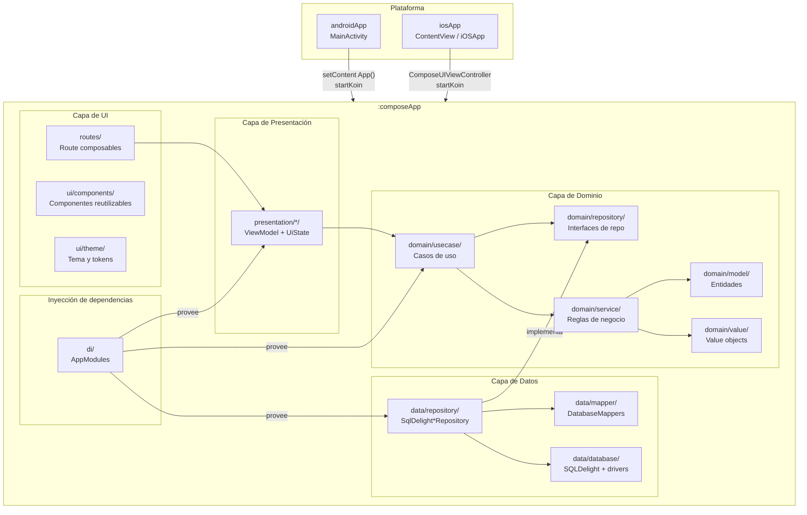
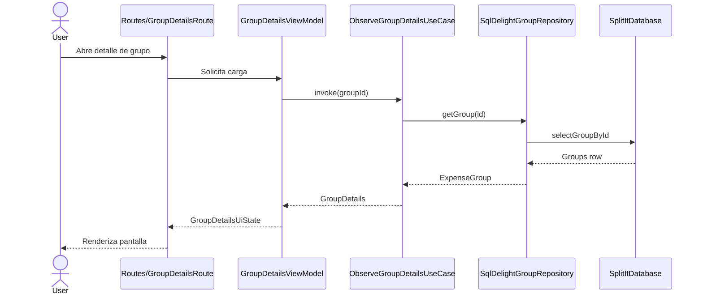
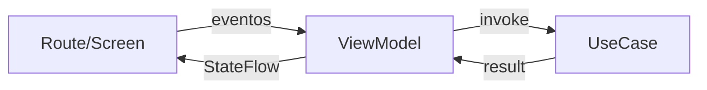
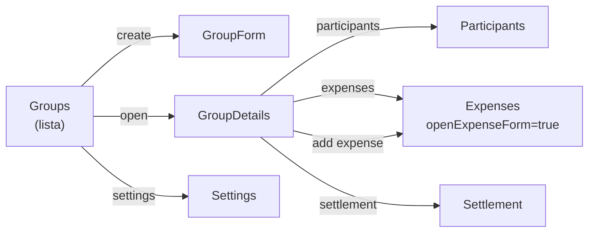
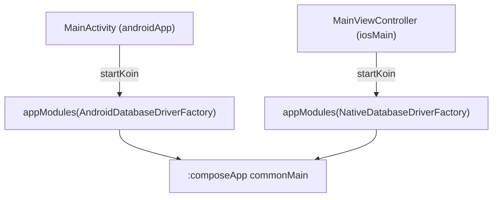
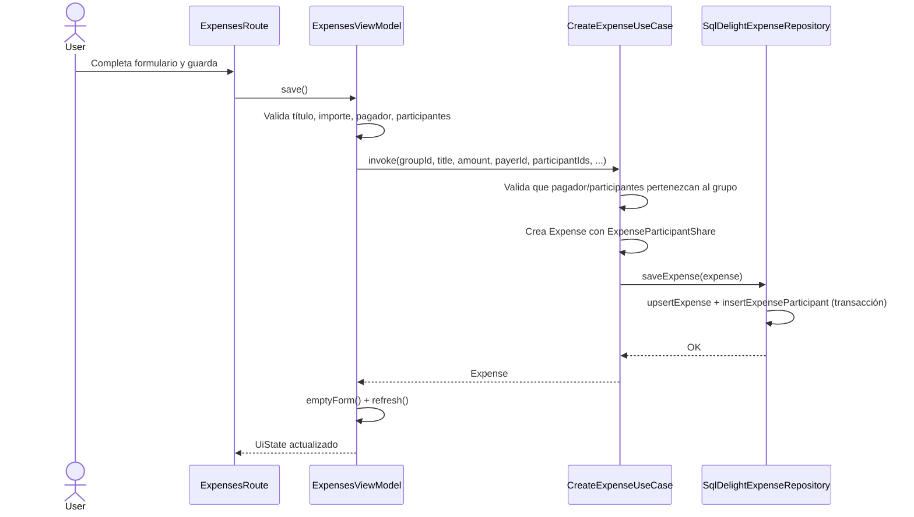
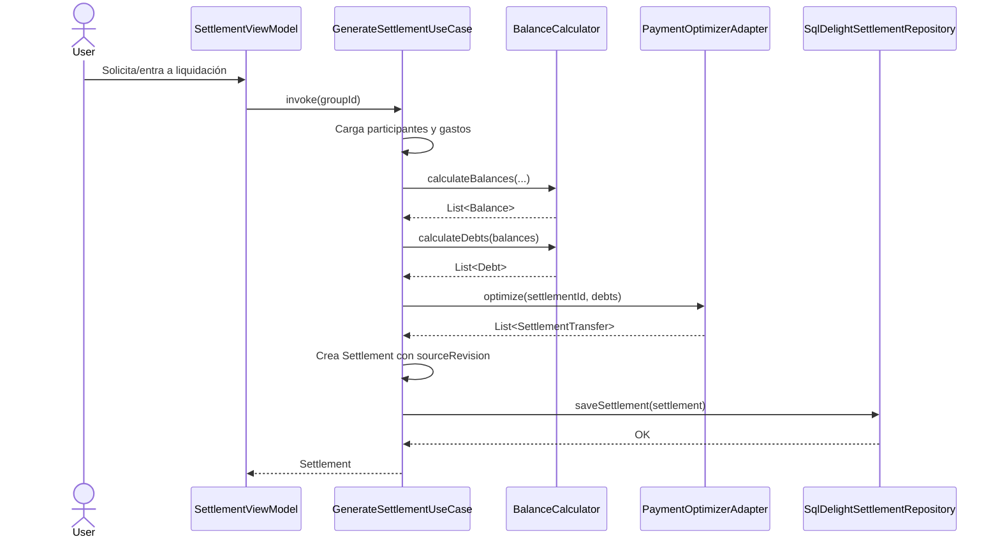
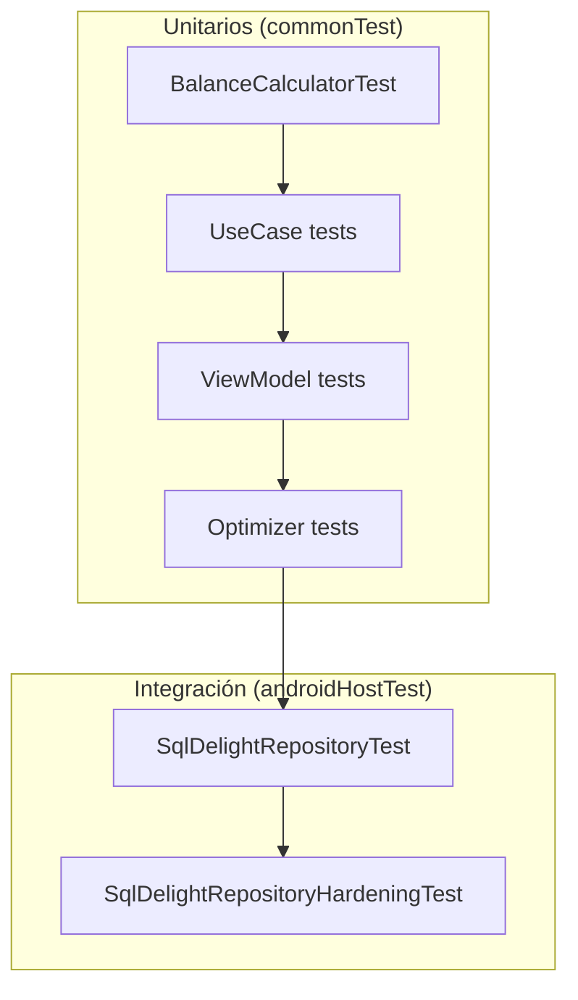

# SplitIt — Documento de Arquitectura

> **Propósito:** describir la arquitectura de SplitIt a nivel de capas, responsabilidad de paquetes, flujos de datos y decisiones de diseño. Complementa a [`DESIGN.md`](./DESIGN.md), que detalla el sistema visual y por pantalla.

---

## 1. Resumen ejecutivo

SplitIt es una aplicación Kotlin Multiplatform (KMP) con **Compose Multiplatform** que comparte UI, dominio y datos entre **Android** e **iOS**. El código compartido vive en el módulo `:composeApp`; cada plataforma aporta solo el wiring mínimo necesario para arrancar Koin, crear el driver de base de datos y montar el punto de entrada de Compose.

Los objetivos arquitectónicos son:

- **Máximo código compartido**: UI, lógica de negocio, persistencia y navegación residen en `commonMain`.
- **Testabilidad**: la capa de dominio es pura y se testea en `commonTest` con dobles en memoria; la integración con SQLite se valida en `androidHostTest`.
- **Independencia de frameworks**: el dominio no conoce Compose, SQLDelight ni Koin.
- **Escalabilidad local**: cada pantalla tiene su `ViewModel`, `UiState` inmutable y caso(s) de uso desacoplados.

---

## 2. Módulos y distribución de código

```text
SplitIt/
├── composeApp/          # Librería KMP compartida (UI + dominio + datos)
│   ├── src/commonMain/  # Código compartido Android + iOS
│   ├── src/androidMain/ # Driver Android, expect/actual mínimos
│   ├── src/iosMain/     # Driver iOS, expect/actual mínimos
│   ├── src/commonTest/  # Tests unitarios multiplataforma
│   └── src/androidHostTest/ # Tests con SQLite real (JDBC)
├── androidApp/          # Aplicación Android: MainActivity + Koin
└── iosApp/              # Aplicación iOS: SwiftUI host + MainViewController
```

| Módulo        | Responsabilidad                                                                                                     |
|---------------|---------------------------------------------------------------------------------------------------------------------|
| `:composeApp` | Todo lo compartido: modelos de dominio, casos de uso, repositorios, base de datos, UI, tema, navegación y recursos. |
| `:androidApp` | `MainActivity` que inicia Koin con el driver Android y llama a `App()`.                                             |
| `iosApp/`     | `iOSApp`/`ContentView` en SwiftUI que monta `MainViewController()` exportado por Kotlin/Native.                     |

**Regla de ubicación:**

- Cambios de UI, dominio, datos, DI o presentación → `composeApp/src/commonMain`.
- Integraciones de plataforma → `composeApp/src/androidMain`, `composeApp/src/iosMain` o `:androidApp`.

---

## 3. Vista de capas

SplitIt sigue una **arquitectura limpia/layered** con dependencias que apuntan hacia el centro: el dominio.



### Flujo de una interacción típica



---

## 4. Capa de dominio (`com.splitit.domain`)

El dominio es independiente de Android, iOS, Compose y SQLDelight. Contiene entidades, value objects, reglas de negocio, contratos de repositorio y casos de uso.

### 4.1 Entidades (`domain/model/`)

| Clave                               | Descripción                                                                                                         |
|-------------------------------------|---------------------------------------------------------------------------------------------------------------------|
| `ExpenseGroup`                      | Grupo de gastos con título, descripción, estado (Active/Archived), timestamps y referencias a participantes/gastos. |
| `Participant`                       | Persona que pertenece a un grupo: nombre y color de avatar.                                                         |
| `Expense`                           | Gasto individual: título, importe (`Money`), pagador, reparto (`ExpenseParticipantShare`), fecha y nota.            |
| `Settlement` / `SettlementTransfer` | Liquidación generada y las transferencias necesarias para saldar.                                                   |
| `Balance` / `Debt`                  | Resultados intermedios del cálculo de balances.                                                                     |

Los constructores validan invariantes (título no vacío, importe positivo, al menos un participante, etc.).

### 4.2 Value objects (`domain/value/`)

| Clave                                                                 | Descripción                                                                                           |
|-----------------------------------------------------------------------|-------------------------------------------------------------------------------------------------------|
| `Money`                                                               | Importe en unidades menores + código ISO de moneda. Operaciones aritméticas con validación de divisa. |
| `GroupId`, `ParticipantId`, `ExpenseId`, `SettlementId`, `TransferId` | Inline/value classes que evitan mezclar identificadores y validan que no sean vacíos.                 |
| `Clock` / `IdGenerator`                                               | Abstracciones de infraestructura usadas desde el dominio para fechas e IDs.                           |

### 4.3 Reglas de negocio (`domain/service/` y `logic/`)

| Componente                 | Responsabilidad                                                                                                                           |
|----------------------------|-------------------------------------------------------------------------------------------------------------------------------------------|
| `BalanceCalculator`        | Calcula balances netos por participante a partir de gastos y repartos ponderados. Genera deudas simplificadas deudor→acreedor.            |
| `SourceRevisionCalculator` | Crea un *fingerprint* estable (FNV-1a) del estado actual de participantes y gastos para detectar si una liquidación quedó desactualizada. |
| `PaymentOptimizerAdapter`  | Adapta las deudas del dominio al modelo `Payment`/`Participant` del optimizador heredado y devuelve `SettlementTransfer`s.                |
| `ComposedOptimizer`        | Orquesta una lista de optimizadores de deuda hasta que ninguno pueda mejorar el resultado.                                                |
| `CycleOptimizer`           | Elimina deudas mutuas (A→B y B→A) compensando importes.                                                                                   |
| `TransitiveOptimizer`      | Reduce cadenas transitivas (A→B→C) a transferencias directas.                                                                             |

> **Nota histórica:** los tipos `com.splitit.domain.Payment` y `com.splitit.domain.Participant` (optimizador) son un modelo interno más antiguo usado exclusivamente por los optimizadores de deuda. El resto del dominio utiliza los modelos en `domain/model/`.

### 4.4 Contratos de repositorio (`domain/repository/`)

Las interfaces definen el contrato de persistencia sin acoplar a SQLDelight:

- `GroupRepository`
- `ParticipantRepository`
- `ExpenseRepository`
- `SettlementRepository`
- `SettingsRepository` (incluye `AppSettings` y `ThemeMode`)

### 4.5 Casos de uso (`domain/usecase/`)

Cada caso de uso representa una operación de negocio atómica. Se definen como clases con `operator fun invoke(...)`.

| Grupo         | Casos de uso                                                                                                           |
|---------------|------------------------------------------------------------------------------------------------------------------------|
| Grupos        | `CreateGroupUseCase`, `UpdateGroupUseCase`, `DeleteGroupUseCase`, `ObserveGroupsUseCase`, `ObserveGroupDetailsUseCase` |
| Participantes | `AddParticipantUseCase`, `UpdateParticipantUseCase`, `RemoveParticipantUseCase`                                        |
| Gastos        | `CreateExpenseUseCase`, `UpdateExpenseUseCase`, `DeleteExpenseUseCase`                                                 |
| Liquidación   | `CalculateGroupBalancesUseCase`, `GenerateSettlementUseCase`                                                           |
| Ajustes       | `GetSettingsUseCase`, `SaveSettingsUseCase`                                                                            |

`ObserveGroupDetailsUseCase` devuelve `GroupDetails`, un agregado de lectura que expone `currentSourceRevision` e `isSettlementStale`.

---

## 5. Capa de datos (`com.splitit.data`)

### 5.1 Persistencia con SQLDelight

El esquema (`composeApp/src/commonMain/sqldelight/com/splitit/data/database/SplitItDatabase.sq`) modela:

- `groups`
- `participants`
- `expenses`
- `expense_participants` (reparto con `share_weight`)
- `settlements`
- `settlement_transfers`
- `settings`

Las columnas `deleted_at` permiten futura implementación de borrado lógico; actualmente las queries filtran `deleted_at IS NULL` y los borrados físicos se ejecutan en cascada desde los repositorios.

### 5.2 Drivers por plataforma

| Plataforma | Clase                          | Implementación                                        |
|------------|--------------------------------|-------------------------------------------------------|
| Android    | `AndroidDatabaseDriverFactory` | `AndroidSqliteDriver` con `PRAGMA foreign_keys = ON`. |
| iOS        | `NativeDatabaseDriverFactory`  | `NativeSqliteDriver` con `PRAGMA foreign_keys = ON`.  |

### 5.3 Repositorios concretos

`SqlDelightGroupRepository`, `SqlDelightParticipantRepository`, `SqlDelightExpenseRepository`, `SqlDelightSettlementRepository` y `SqlDelightSettingsRepository` implementan las interfaces de dominio y se encargan de:

- Ejecutar transacciones SQLDelight.
- Mapear filas a modelos de dominio vía `data/mapper/DatabaseMappers.kt`.
- Garantizar integridad (por ejemplo, borrado en cascada al eliminar un grupo).

### 5.4 Mappers

`DatabaseMappers.kt` actúa como **anti-corruption layer** entre el modelo relacional generado por SQLDelight y el modelo de dominio. Cada función de extensión (`Groups.toDomain()`, `Expenses.toDomain(...)`, etc.) centraliza la traducción.

---

## 6. Capa de presentación

### 6.1 ViewModels (`presentation/*/`) y Routes (`routes/`)

La capa de presentación está dividida en dos responsabilidades:

| Paquete           | Responsabilidad                                                                                                                           |
|-------------------|-------------------------------------------------------------------------------------------------------------------------------------------|
| `presentation/*/` | `ViewModel` que expone un `StateFlow<UiState>` y contiene la lógica de pantalla (validaciones, búsquedas, agrupaciones).                  |
| `routes/*/`       | Composable "Route" que obtiene el `ViewModel` vía Koin, reacciona al estado y delega eventos. Separa la orquestación de la renderización. |

Cada `UiState` es una `data class` marcada con `@Immutable` que representa todos los estados de la pantalla:

```kotlin
@Immutable
data class GroupListUiState(
    val groups: List<ExpenseGroup> = emptyList(),
    val visibleGroups: List<ExpenseGroup> = emptyList(),
    val searchQuery: String = "",
    val isLoading: Boolean = true,
    val errorMessage: String? = null,
    // ...
)
```

### 6.2 Flujo de datos unidireccional



Los `ViewModel` usan `viewModelScope` y `MutableStateFlow.update {}` para mantener la inmutabilidad del estado.

### 6.3 ViewModels por pantalla

| Pantalla            | ViewModel               |
|---------------------|-------------------------|
| Lista de grupos     | `GroupListViewModel`    |
| Detalle de grupo    | `GroupDetailsViewModel` |
| Formulario de grupo | `GroupFormViewModel`    |
| Participantes       | `ParticipantsViewModel` |
| Gastos              | `ExpensesViewModel`     |
| Liquidación         | `SettlementViewModel`   |
| Ajustes             | `SettingsViewModel`     |

---

## 7. Capa de UI y sistema de diseño (`com.splitit.ui`)

### 7.1 Tema y tokens

`SplitItTheme` configura `MaterialTheme` con el esquema de colores propio y provee tres `CompositionLocal`:

- `LocalSplitItSemanticColors`: colores semánticos de dominio (`credit`, `debt`, `settled`, `staleWarning`, etc.).
- `LocalSplitItMoneyStyles`: estilos tipográficos para importes con `tnum` (números tabulares).
- `LocalSplitItDarkTheme`: booleano que indica si el tema activo es oscuro.

Además, `SplitItSpacing` y `SplitItShapes` centralizan espaciado y formas.

### 7.2 Componentes reutilizables (`ui/components/`)

| Componente                                 | Uso                                                  |
|--------------------------------------------|------------------------------------------------------|
| `AvatarBubble` / `AvatarStack`             | Representación visual de participantes.              |
| `MoneyText`                                | Importes formateados con variantes hero/row/caption. |
| `StatusChip`                               | Estados "al día", "pendiente", "stale".              |
| `GroupCard`, `ExpenseCard`, `TransferCard` | Tarjetas de dominio.                                 |
| `BalanceBarChart`                          | Gráfico de barras divergentes (Canvas).              |
| `SearchField`, `FormTextField`             | Campos de entrada estandarizados.                    |
| `PrimaryButton` / `SecondaryButton`        | Botones con estado de carga.                         |
| `EmptyState`, `ErrorState`, `LoadingState` | Estados comunes de pantalla.                         |
| `ConfirmDeleteDialog`                      | Diálogo de confirmación unificado.                   |

---

## 8. Navegación

La navegación utiliza **Jetpack Navigation Compose** con destinos **type-safe** marcados con `@Serializable`.



### Destinos

| Destino        | Tipo          | Parámetros relevantes                         |
|----------------|---------------|-----------------------------------------------|
| `Groups`       | `data object` | —                                             |
| `GroupDetails` | `data class`  | `groupId: String`                             |
| `GroupForm`    | `data class`  | `groupId: String?` (null = crear)             |
| `Participants` | `data class`  | `groupId: String`                             |
| `Expenses`     | `data class`  | `groupId: String`, `openExpenseForm: Boolean` |
| `Settlement`   | `data class`  | `groupId: String`                             |
| `Settings`     | `data object` | —                                             |

### Transiciones

- Jerarquía (grupos → detalle → gastos/liquidación): **slide horizontal** compartido (300 ms, `FastOutSlowIn`).
- `Settings`: **fade** (400 ms) porque es un destino de mismo nivel.

---

## 9. Inyección de dependencias

Se utiliza **Koin** en `commonMain` con tres módulos:

| Módulo               | Responsabilidad                                                                                                                                       |
|----------------------|-------------------------------------------------------------------------------------------------------------------------------------------------------|
| `dataModule`         | Provee `SplitItDatabase` y las implementaciones `SqlDelight*Repository`. Recibe `DatabaseDriverFactory` como parámetro de plataforma.                 |
| `domainModule`       | Provee casos de uso (factory), servicios singleton (`BalanceCalculator`, `DefaultLocalizationService`), `Optimizer<Payment>`, `Clock`, `IdGenerator`. |
| `presentationModule` | Provee `ViewModel`s; los que necesitan `groupId` usan parámetros de Koin.                                                                             |

### Wiring por plataforma



`KoinApplicationContext` se guarda en una variable estática para evitar reiniciar el contenedor si la Activity/view controller se recrea.

---

## 10. Flujos de negocio clave

### 10.1 Registrar un gasto



### 10.2 Generar una liquidación



### 10.3 Detección de liquidación desactualizada (stale)

1. `ObserveGroupDetailsUseCase` devuelve `GroupDetails`.
2. `GroupDetails.currentSourceRevision` recalcula el fingerprint con `SourceRevisionCalculator`.
3. `isSettlementStale` compara ese fingerprint con `latestSettlement.sourceRevision`.
4. Las pantallas muestran un banner ámbar cuando no coinciden.

### 10.4 Reparto ponderado de gastos

`BalanceCalculator.splitExpense()` y `computeWeightedShares()` en `ExpensesViewModel` reparten un importe total según pesos enteros positivos (`shareWeight`), garantizando que:

- La suma de las partes iguale exactamente el importe total.
- El redondeo de unidades menores se aplique de forma determinista (mayor resto, luego ID ascendente).

---

## 11. Patrones utilizados

| Patrón                                | Dónde se aplica                                                                     |
|---------------------------------------|-------------------------------------------------------------------------------------|
| **Clean / Layered Architecture**      | Separación UI → Presentación → Dominio → Datos.                                     |
| **Repository Pattern**                | Interfaces en dominio, implementaciones SQLDelight en datos.                        |
| **Use Case / Command Pattern**        | Un caso de uso por operación de negocio.                                            |
| **MVVM + Unidirectional Data Flow**   | `ViewModel` expone `StateFlow<UiState>`; la UI envía eventos.                       |
| **Dependency Injection**              | Koin en todos los módulos.                                                          |
| **Type-safe Navigation**              | Destinos `@Serializable` con `navigation-compose`.                                  |
| **Value Classes**                     | IDs tipadas (`GroupId`, `ExpenseId`, etc.).                                         |
| **Value Object**                      | `Money` encapsula importe y moneda.                                                 |
| **Adapter**                           | `PaymentOptimizerAdapter` entre modelo de dominio y modelo del optimizador.         |
| **Chain of Responsibility**           | `ComposedOptimizer` aplica `CycleOptimizer` y `TransitiveOptimizer` iterativamente. |
| **Anti-Corruption Layer**             | `DatabaseMappers.kt` aísla modelos de base de datos de modelos de dominio.          |
| **CompositionLocal**                  | Tokens de diseño semánticos accesibles desde cualquier composable.                  |
| **Factory Method / Abstract Factory** | `DatabaseDriverFactory` con implementaciones por plataforma.                        |

---

## 12. Decisiones de diseño relevantes

### 12.1 Kotlin Multiplatform + Compose Multiplatform

Se eligió KMP para compartir no solo la lógica, sino también la UI, reduciendo la duplicación entre Android e iOS. Los recursos (strings, iconos vectoriales) viven en `composeResources` y se sirven en ambas plataformas.

### 12.2 SQLDelight como capa de persistencia

SQLDelight permite escribir SQL tipado en `commonMain` y genera drivers nativos para Android e iOS. Se prefirió sobre Room u ORMs propietarios por su soporte KMP nativo y su esquema explícito.

### 12.3 IDs tipadas y `Money` como value object

Las inline classes evitan errores como pasar un `groupId` donde se espera un `participantId`. `Money` fuerza el manejo explícito de moneda y evita operaciones entre divisas.

### 12.4 `SourceRevisionCalculator` en lugar de confiar solo en timestamps

Detectar cambios solo por `updatedAtMillis` falla ante borrados o múltiples ediciones en el mismo milisegundo. El fingerprint FNV-1a incluye todo el estado fuente (participantes + gastos + repartos), haciendo la detección de *stale* robusta y determinista.

### 12.5 Separación `routes/` vs `presentation/`

- `presentation/` contiene ViewModels y UiStates puros de lógica de pantalla.
- `routes/` contiene composables que orquestan ViewModel + navegación + recursos de Compose.

Esto permite testear la lógica de presentación sin necesidad de montar Compose.

### 12.6 `LocalizationService` como abstracción

Los `ViewModel` no acceden directamente a `Res.string`; usan `LocalizationService`, lo que permite:

- Testear mensajes de error en `commonTest` sin inicializar recursos de Compose.
- Sustituir fácilmente la fuente de strings si fuera necesario.

### 12.7 Moneda por defecto `UYU`

`DefaultCurrencyCode = "UYU"` refleja el contexto de uso principal de la aplicación.

### 12.8 Vocabulario unificado "Groups"

El código y el copy visible usan consistentemente "Group"/"Grupo". No quedan restos del antiguo vocabulario "Session"/"Sesión".

### 12.9 Pragma `foreign_keys = ON`

Ambos drivers habilitan claves foráneas en SQLite para que `ON DELETE CASCADE` funcione correctamente.

### 12.10 Estrategia de tests

- `commonTest`: dominio, use cases, ViewModels y optimizadores con repositorios en memoria (`InMemoryRepositories`).
- `androidHostTest`: integración real con SQLDelight sobre SQLite en memoria (JDBC).
- Esto permite tests rápidos en la mayoría de la lógica y tests de integridad solo donde toca la base de datos.

---

## 13. Tests

### Pirámide de tests



### Comandos útiles

```bash
# Tests unitarios JVM
./gradlew :composeApp:testAndroidHostTest

# Un test concreto
./gradlew :composeApp:testAndroidHostTest --tests 'com.splitit.domain.service.BalanceCalculatorTest'

# Lint
./gradlew :androidApp:lint :composeApp:lint

# Verificación completa
./gradlew :androidApp:check :composeApp:check
```

### Dobles de test

`commonTest/kotlin/com/splitit/testutils/` incluye:

- `InMemoryRepositories`: implementaciones en memoria de todos los repositorios.
- `TestFixtures`: datos de prueba reutilizables.
- `TestLocalization`, `CoroutineTestSupport`, `Comparators`: utilidades de test.

---

## 14. Notas y advertencias conocidas

- **Warning de SQLDelight en JDK 21:** `app.cash.sqldelight:compiler-env` emite un aviso sobre `sun.misc.Unsafe::objectFieldOffset`. Es inocuo y se silencia automáticamente en JDK 23+ con `--sun-misc-unsafe-memory-access=allow`.
- **Límite del optimizador:** el modelo `Payment` heredado usa `Int` para el importe; `PaymentOptimizerAdapter` verifica que `minorUnits <= Int.MAX_VALUE` antes de convertir.
- **Navegación type-safe:** los parámetros de ruta son `String` (por requisitos de serialización); se reconstruyen como value classes (`GroupId`) en el punto de entrada de cada Route.
- **Recursos de plataforma:** `appVersion()` se implementa como `expect/actual` porque la versión se lee del `PackageManager` en Android y de `NSBundle` en iOS.

---

## 15. Referencias

- [`DESIGN.md`](./DESIGN.md): sistema de diseño visual y especificación por pantalla.
- [`AGENTS.md`](../AGENTS.md): convenciones del proyecto, comandos y límites.
- [`README.md`](../README.md): instrucciones básicas de build y ejecución.
